# 🔌 API Documentation

## 📖 Overview
The application utilises a hybrid approach, with two distinct ways to access the backend. Standard data operations leverage the auto-generated REST interface via the *Supabase Client SDK*, while complex business logic is isolated in *Serverless Edge Functions*.

```mermaid
---
title: Hybrid API Communication Flow
---
flowchart TD
    App["📱 Mobile App"] -- "Simple CRUD" --> SDK["📦 Supabase SDK"]
    App -- "Complex Logic" --> Edge["⚡ Edge Functions"]
    
    SDK --> DB[("🗄️ PostgreSQL")]
    
    Edge --> Secrets["🔐 Vault (API Keys)"]
    Edge --> ThirdParty["🌐 External APIs<br/>(Weather / Twilio)"]
    Edge --> DB
```

## ⚒️ 1. Supabase Client SDK 

This is used for simple things like reading/writing to the PostgreSQL tables using standard CRUD operations from the [Supabase JavaScript Client](https://supabase.com/docs/reference/javascript/introduction). Access is strictly governed by **Row Level Security (RLS)**, ensuring users can only interact with their own data.

E.g.

| Action | Resource | Example SDK Usage |
| :----- | :------- | :---------------- |
| **Read** | `bikes` | `supabase.from('bikes').select('*')` |
| **Create** | `routes` | `supabase.from('routes').insert({ name, path_geometry })` |
| **Update** | `user_profiles` | `supabase.from('user_profiles').update({ avatar_url }).eq('id', uid)` |
| **Sync** | `ride_history` | `supabase.from('ride_history').upsert(telemetry_data)` |

## ⚡ 2. Edge Funtions:

For the complex tasks that require API secret keys or more intensive processing the app sends requests to Supabase edge functions. These are written in *Typescript* and executed via the [Deno](https://deno.com/) runtime. 

> [!NOTE]
> Supabase uses the Deno runtime rather than Node.js; however, it natively supports npm modules and Node built-in APIs.

### 🛣️ Route Analysis
**Endpoint:** `(POST /functions/v1/analyze-route)`\
**RequestBody:** `{route_geometry, start_time}`\
**Output:** `{ hazards: [], safe: boolean }`
  
This function processes a planned route based on the journey start time. It performs the following steps:

1. Samples the route geometry approximately every 10 km.
2. Fetches weather data from the OpenWeatherMap API for each segment.
3. Flags dangerous conditions exceeding defined thresholds (e.g., heavy rain or wind speeds > 40 km/h).
4. Returns a list of hazards corresponding to each specific segment.

### 📞🆘 Emergency SOS
**Endpoint:** `(POST /functions/v1/send-sos)`\
**RequestBody:** `{ location, battery_level }`\
**Output:** `{ success: boolean, sent_attempt: n }`
   
This is triggered by the in-app Emergency button, this function:
1. Verifies the active user session and help request.
2. Retrieves the user's prioritized emergency contacts from the database.
3. Sends an SMS via the **Twilio API** containing the user's GPS location, a Google Maps link, and their current battery level.
