# ⚙️ Backend Documentation 

## 🏗️ 1. Architecture Overview
* **Runtime:** Node.js.
* **Framework:** Express.js.
* **Language:** TypeScript.
* **Architecture Style:** Layered Architecture with a Service Layer pattern to handle complex business logic, such as weather analysis.

```mermaid
---
title: Backend Layered Architecture
---
flowchart LR
    %% Nodes
    API["🌧️ Weather API<br/>(raw JSON)"]
    Model["📦 Model<br/>Weather objects"]
    Service["🧠 Service Layer<br/>(WeatherService)<br/>analyzeWeather()<br/>calculateAlerts()"]
    ViewModel["🖥️ Data Mapper<br/>Formats data for<br/>API response"]
    View["📱 Client App<br/>(Frontend)"]

    %% Flow
    API --> Model
    Model --> Service
    Service --> ViewModel
    ViewModel --> View

```

## 🧩 2. Backend Stack & Integrations
* [PostgreSQL](https://www.postgresql.org/) serves as the primary database, utilizing the [**PostGIS**](https://postgis.net/) extension to handle complex geographic queries and spatial data efficiently.
* [Supabase](https://supabase.com/) acts as our core hosting provider and development platform, managing the backend infrastructure and database hosting.
* [Supabase Auth](https://supabase.com/auth) manages user sessions via JWTs, supporting both traditional Email/Password and Social Login methods.
* [OpenWeatherMap API](https://openweathermap.org/api/one-call-3) provides real-time weather data via an Adapter Pattern (`IWeatherProvider`), allowing for easy swaps to other providers like Met.no.
* [Twilio API](https://www.twilio.com/en-us) handles emergency SMS triggers from the backend, ensuring critical alerts are delivered even if the client-side app crashes.
* [Mapbox Directions API](https://docs.mapbox.com/api/navigation/directions/) generates route coordinates for analysis and pathfinding.

## 🔌 3. API Specification
The backend communicates with the frontend via a structured API. For a full list of endpoints and request/responses schemas, please refer to the [**api.md**](./api.md) document.

* **Protocol:** RESTful API.
* **Format:** JSON.
* **Versioning:** `/api/v1/...`

## 🔐 4. Security
* **Row Level Security (RLS):** Enforced at the database level to ensure strict data isolation; users can only access their own records.
* **Authentication:** JSON Web Tokens (JWT) are used for secure session management and request authorization.

## 🧠 5. Main Business Logic
**Route Analysis Workflow:**

1. **Input:** Receive Start/End coordinates from the client.
2. **Fetch:** Retrieve Route Geometry from Mapbox.
3. **Segment:** Divide the route into segments (e.g., every 15 mins or 10km).
4. **Enrich:** Fetch weather data for each segment's specific timestamp and location.
5. **Analyze:** Return an enriched route object containing "Hazard Flags" (e.g., *"Segment 3: Heavy Rain"*).