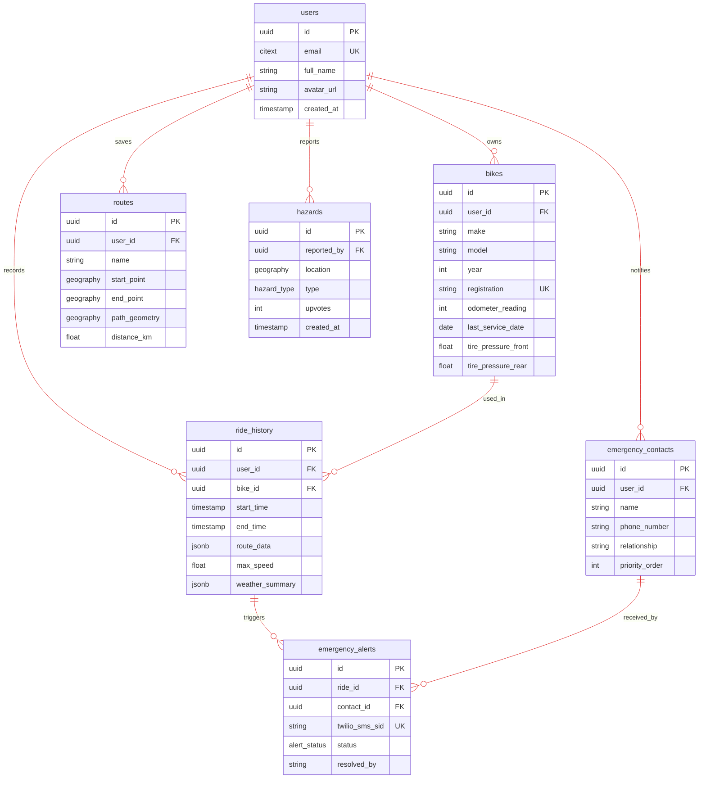

# 🗄️ Database Schema  

## 📖 Overview
[PostgreSQL](https://www.postgresql.org/) serves as the application's primary database, hosted on [Supabase](https://supabase.com/) to leverage integrated authentication and real-time capabilities. This schema utilizes the [PostGIS](https://postgis.net/) extension for advanced spatial queries and high-performance geographic data handling. Additionally, `citext` and `uuid-ossp` are used for case-insensitive string comparisons and Universally Unique Identifiers (UUIDs), respectively.

## 📋┬─┬ Tables Overview

| Table | Description | Constraints | Key Relationships |
| :---: | :---------- | :-----------| :---------------- |
| **`users`** | Profiles extending Supabase Auth. | `email` (Unique, CITEXT) | **1:1** with `auth.users` |
| **`bikes`** | Motorcycle inventory and maintenance data. | `registration` (Unique) | **Many:1** with `users` |
| **`emergency_contacts`** | User-defined SOS recipients. | `priority_order` (Not Null) | **Many:1** with `users` |
| **`routes`** | Saved and planned paths with geometry. | `path_geometry` (Geography) | **Many:1** with `users` |
| **`ride_history`** | Logs of completed trips and telemetry. | `start_time` (Not Null) | **Many:1** with `users`/`bikes` |
| **`hazards`** | Community-reported road conditions. | `type` (Enum) | **Many:1** with `users` |
| **`points_of_interest`** | User-marked locations (Fuel, etc.). | `category` (Enum) | **Many:1** with `users` |
| **`emergency_alerts`** | Audit log of SOS activations and SMS status. | `twilio_sms_sid` (Unique) | **Many:1** with `ride_history` |

> [!NOTE]
> * All geographic columns use the `GEOGRAPHY` type for accurate real-world distance calculations, with **GIST indexes** used for efficient proximity searching.
> * `ride_history` stores `route_data` as a `JSONB` snapshot to preserve historical trip telemetry even if source routes are modified.
> * `emergency_alerts` logs every individual notification attempt; one SOS event can generate multiple alert rows - one for each contact notified.
> * Row Level Security (RLS) is enforced on all user-specific tables, ensuring users only access rows where `user_id` matches their `auth.uid()`.

## 🤝 Entity Relationship Diagram
