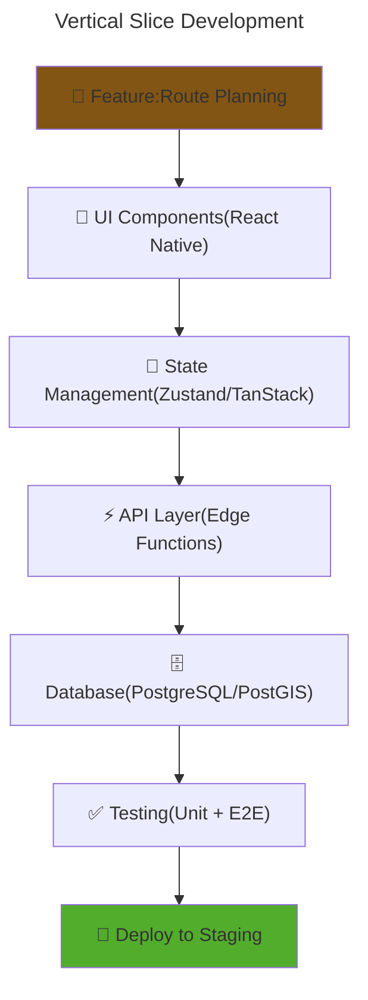
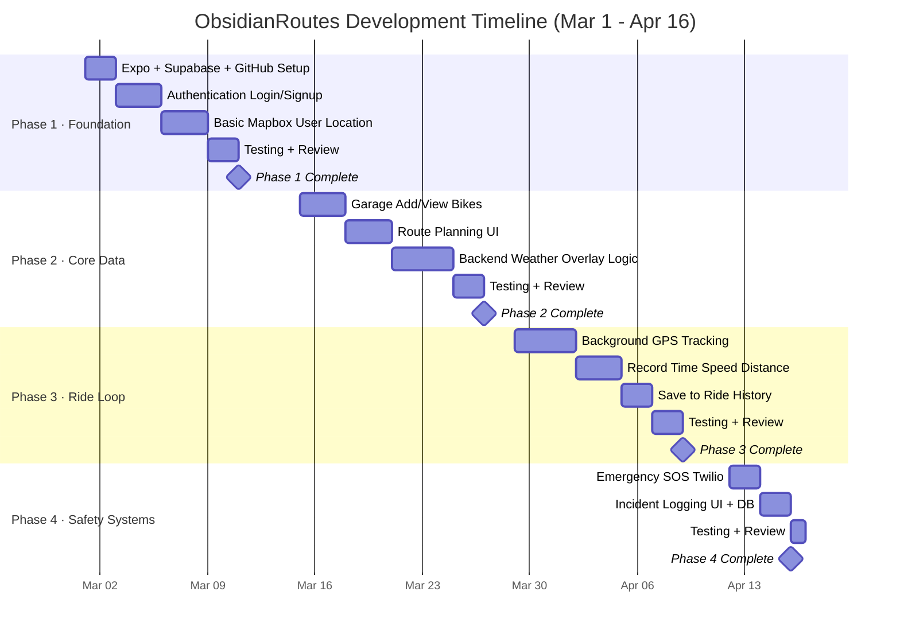

# 🚀 Development Plan
## 📖 Overview
Obsidian Routes follows an Agile development methodology using 2-week sprints to deliver the MVP by May 2026 Rather than builfing the layers horizontally (All UI then backend then DB) i adopted a vertical slice approch like comoketeing one feature end to end.(Frontend + Backernd + Database) befoere moving to the next.Thid will ensure that each sprint delivers working and testable functionality.

## 🎯 Development View

### Vertical Slicing Architecture
Each feature is built as a complete vertical slice through the entire stack 

### Why Use Vertical Slices
* **Early Feadback**: The features can be tested by the stackholders immediately. rather than waiting untill the end project is done 
* **Reduce of Risk**: The integration isses are discovered early in the development cycle not at the final integration phase when they are hard/expensive to fix.
* **Value**: Each sprint devlivers usable functionality. If the project timeline is compressed i will stioll have working features rather than partial componernts across the layers 
* **Easy to Pivot**: If the requirements change or feature proves unnecessory there wont be anytime wasted building infrastructure across all layers that wont be used.  
* **Better Testing**: The end-to-end testing becomes possible immediately which provides confidence that the entire stack works together correctly.

---

## 🏗️ Development Principles

### 1. Feature completed over layer complete
Building the stack for one feature befopre starting another 
- Database schema with proper index 
- Backend API endpoints with error handeling 
- Frontend UI components with state management
- Documentation for the Features
**Example**: complete the entire emergency SOS feature (DB, Twilio integration, UI button , contact managemnt, Testing )before starting route planning

### 2. MVP First approch
Prioritizing rthe phase 1 features fromt eh PRD.md. phase 2 features(road hazard reporting, social sharing maintenance tracking) are deffered after the launch.

### 3. Continous integration and quality checks
Every feature branch must pass the automated checks before merging into it.
  - ESLint(Quality of the code)
  - TypeScript (type safty)
  - Jest unit tests (logic)
  - Prittier (code formatting)
Manual testing is performed at the end of each sprint on the physical deveice 

### 4. Documentation 
documenting each feature  immediately after completion while the context is fresh
- API end point specifications
- database schema changes
- UI component usage
- known limitations
---

## 📅 Sprint Structure (2-Week Cycles)

Each sprint follows this rhythm:

| Phase | Duration | Activities |
|:------|:---------|:-----------|
| **Planning** | 1 day | Define sprint goal, select features from backlog, break into tasks |
| **Development** | 8 Days | Build feature for vertically (DB -> API -> UI) |
| **Testing** | 2 Days  | Manual testing, E2E tests, bug fixes |
| **Review** | 1 Day | Demo feature, document, update backlog|
---

## 🗓️ Project Timeline & Gantt Chart

### Sprint Overview
| Phase | Dates | Goal | Deliverables |
|:------|:------|:-----|:-------------|
| **Phase 1** | Mar 1 – Mar 14 | Foundation — setup, auth, map | Expo + Supabase configured, login/signup, user location on map |
| **Phase 2** | Mar 15 – Mar 28 | Core Data — garage and route planning | Bike CRUD, route planning UI, weather analysis backend |
| **Phase 3** | Mar 29 – Apr 11 | Ride Loop — GPS tracking and history | Background GPS, ride recording, ride history saved |
| **Phase 4** | Apr 12 – Apr 16 | Safety Systems — SOS and incidents | Twilio SOS integration, incident logging UI + DB |

### Gantt Chart

## 🔍 Phase Breakdown

### Phase 1: Foundation · Mar 1 – Mar 14

* **Project Setup** — Expo, Supabase, GitHub repository and CI/CD pipeline configured.
* **Authentication** — Login and signup flows (email/password and Google OAuth).
* **Basic Mapbox Integration** — Display user's current location on the map.

### Phase 2: Core Data · Mar 15 – Mar 28

* **Garage** — Add and view bikes (make, model, year, plate, odometer).
* **Route Planning Interface** — Draw a route on the map with start/end input.
* **Backend Route Analysis** — Weather overlay logic: segment route, fetch weather per segment, return hazard flags.

### Phase 3: The Ride Loop · Mar 29 – Apr 11

* **Live GPS Tracking** — Background location tracking (the most complex feature).
* **Ride Recording** — Capture time, speed, and distance in real time.
* **Save to History** — Persist completed ride data to the database.

### Phase 4: Safety Systems · Apr 12 – Apr 16

* **Emergency SOS** — One-tap SOS triggering Twilio SMS to emergency contacts with GPS location and battery level.
* **Incident Logging** — In-ride hazard reporting UI and database persistence.

---
