<div style="
  display: flex;
  flex-direction: column;
  justify-content: center;
  align-items: center;
  height: 100vh;
  text-align: center;
">
  <h1 style="font-size: 3.2em; font-weight: 700; margin: 0;">
    Obsidian Routes
  </h1>
  <div style="font-size: 1.5em; margin-top: 0.3em; color: #555;">
    Technical Overview
  </div>
</div>

- [📑 Product Requirements Document](#-product-requirements-document)
  - [📖 1. App Overview](#-1-app-overview)
  - [🎯 2. Target Audience](#-2-target-audience)
  - [🚀 3. Key Features \& Prioritisation](#-3-key-features--prioritisation)
    - [Phase 1: MVP (Minimum Viable Product)](#phase-1-mvp-minimum-viable-product)
    - [Phase 2: Future Scope (Post-MVP)](#phase-2-future-scope-post-mvp)
  - [⚠️ 5. Assumptions \& Risks](#️-5-assumptions--risks)
- [🖥️ Frontend Documentation](#️-frontend-documentation)
  - [📐👷🏻‍♀️ 1. Architecture Overview](#️-1-architecture-overview)
  - [🧩 2. Frontend Stack](#-2-frontend-stack)
  - [🗺️ 3. Navigation Structure](#️-3-navigation-structure)
    - [🧭 Bottom tabs for Main Navigation](#-bottom-tabs-for-main-navigation)
    - [☰ Menu for Secondary Navigation](#-menu-for-secondary-navigation)
  - [4. 🎨🖌️ UI/UX Styling](#4-️-uiux-styling)
  - [📍 5. Mapbox Specifics](#-5-mapbox-specifics)
- [⚙️ Backend Documentation](#️-backend-documentation)
  - [🏗️ 1. Architecture Overview](#️-1-architecture-overview-1)
  - [🧩 2. Backend Stack \& Integrations](#-2-backend-stack--integrations)
  - [🔌 3. API Specification](#-3-api-specification)
  - [🔐 4. Security](#-4-security)
  - [🧠 5. Main Business Logic](#-5-main-business-logic)
- [State Management Strategy](#state-management-strategy)
  - [Overview](#overview)
  - [1. Global State(Zustand)](#1-global-statezustand)
    - [what zustand stores](#what-zustand-stores)
    - [🧠 State Management Strategy](#-state-management-strategy)
  - [📖 1. Global State](#-1-global-state)
    - [🗃️ Zustand Stores](#️-zustand-stores)
    - [🔍 TanStack Query Server State](#-tanstack-query-server-state)
  - [📍 2. Local components state](#-2-local-components-state)
  - [2. TanStack Query/ React Query (Server State)](#2-tanstack-query-react-query-server-state)
  - [3. Local components state](#3-local-components-state)
- [🔌 API Documentation](#-api-documentation)
  - [📖 Overview](#-overview)
  - [⚒️ 1. Supabase Client SDK](#️-1-supabase-client-sdk)
  - [⚡ 2. Edge Funtions:](#-2-edge-funtions)
    - [🛣️ Route Analysis](#️-route-analysis)
    - [📞🆘 Emergency SOS](#-emergency-sos)
- [🗄️ Database Schema](#️-database-schema)
  - [📖 Overview](#-overview-1)
  - [📋┬─┬ Tables Overview](#-tables-overview)
  - [🤝 Entity Relationship Diagram](#-entity-relationship-diagram)
- [🛤️ User Flow Documentation](#️-user-flow-documentation)
  - [📖 Overview](#-overview-2)
    - [Diagram Legend](#diagram-legend)
  - [| *Errors / Critical failures* |  |](#-errors--critical-failures---)
  - [1. First Time User](#1-first-time-user)
    - [Happy Path](#happy-path)
    - [Unhappy Path](#unhappy-path)
  - [Route Planning Flow](#route-planning-flow)
    - [Happy Path Flow](#happy-path-flow)
    - [Unhappy Path Flow](#unhappy-path-flow)
  - [3. Starting and Recording a Ride](#3-starting-and-recording-a-ride)
    - [Happy Path Flow](#happy-path-flow-1)
    - [A. Log Hazard Subflow](#a-log-hazard-subflow)
    - [B. Pause ride sub-flow](#b-pause-ride-sub-flow)
    - [C. End Ride Sub-flow](#c-end-ride-sub-flow)
    - [Unhappy path flows](#unhappy-path-flows)
  - [4. Emergency SOS](#4-emergency-sos)
    - [Happy path](#happy-path-1)
    - [Unhappy Path Flows](#unhappy-path-flows-1)
  - [5. Manageing bikes (Garage)](#5-manageing-bikes-garage)
    - [Happy Path Flow](#happy-path-flow-2)
    - [A. Add bike subflow](#a-add-bike-subflow)
    - [B. View/Edit bike sub-flow](#b-viewedit-bike-sub-flow)
    - [C. Log service sub-flow](#c-log-service-sub-flow)
    - [Unhappy Path Flow](#unhappy-path-flow-1)
  - [6. Ride history](#6-ride-history)
    - [Happy path flow](#happy-path-flow-3)
    - [Unhappy path floe](#unhappy-path-floe)
  - [7. Setting Flow](#7-setting-flow)
    - [Happy path Flow](#happy-path-flow-4)
    - [Unhappy Path Flow](#unhappy-path-flow-2)
    - [Color](#color)
- [♾️ DevOps \& CI/CD](#️-devops--cicd)
  - [📖 Overview](#-overview-3)
  - [🪾 1. Source Control \& Branching](#-1-source-control--branching)
  - [֎ 2. GitHub Actions](#-2-github-actions)
  - [📈 3. Monitoring \& Error Tracking](#-3-monitoring--error-tracking)
- [🧪 Testing Plan](#-testing-plan)
  - [📖 Overview of testing](#-overview-of-testing)
  - [✅ 1. Unit testing](#-1-unit-testing)
  - [📝 2. End to End Testing](#-2-end-to-end-testing)
  - [🕵️‍♂️ 3. Manual Testing](#️️-3-manual-testing)
- [📚 Third-Party Libraries](#-third-party-libraries)
  - [🔹 1. Core Framework](#-1-core-framework)
  - [🔹 2. Navigation and UI](#-2-navigation-and-ui)
  - [🔹 3. Map and Location](#-3-map-and-location)
  - [🔹 4. State Management and data](#-4-state-management-and-data)
  - [🔹 5. Form and utilities](#-5-form-and-utilities)
  - [🔹 6. Backend](#-6-backend)
  - [🔹 7. Testing](#-7-testing)
  
---

# 📑 Product Requirements Document
## 📖 1. App Overview
* **Name:** ObsidianRoutes (Working Title)
* **Description:** A mobile safety companion for motorcyclists that combines weather **forecasting** with route planning and emergency features. By integrating all these features in a simple-to-use interface, the app solves the problem of fragmented navigation, eliminating the need to juggle multiple apps while on the road.
* **Platform:** Mobile (🤖 Android First Focus).

## 🎯 2. Target Audience
* **Primary Users:** Motorcyclists of all experience levels, aged 18+.
* **Location:** Initial launch will be in Ireland/Europe :ireland: :european_union:.
* **User Characteristics:** Tech-comfortable, safety-conscious, often ride in variable weather conditions.
* **Pain Points:**
    * 🌧️ Getting caught in unexpected rain or winds
    * 📱 Frequently switching between weather apps and map apps
    * 🛠️ Worrying about breakdowns.
    * 📅 Not remembering when the bike was last serviced.

## 🚀 3. Key Features & Prioritisation

### Phase 1: MVP (Minimum Viable Product)
*  **Route Planning:** Input start/end locations and view the route on the map. 
*  **Weather Along Route:** Weather data points displayed directly on the map every 10–15 km.
*  **Proactive Weather Alerts:** Automatic warnings based on specific thresholds (example metrics): 
    * Rain probability > 70%
    * Temperature < 5°C
    * Wind speed > 40km/h
*  **Emergency SOS:** One-tap button to send current GPS location via SMS to emergency contacts.
*  **Basic User Profile:** Stores rider details and bike specifications (Make/Model).

### Phase 2: Future Scope (Post-MVP)
* **Road Hazard Warnings:** Users can report sharp curves/bends, potholes, debris, etc.
* **Services Finder:** Locating nearby mechanics and petrol stations.
* **Ride Statistics:** Log distance, average speed, and lean angles.
* **Social:** Route sharing and photo uploads.
* **Maintenance:** Service reminders, estimated part wear. 

## ⚠️ 5. Assumptions & Risks
* The riders will have data coverage during the trips.
* Users are okay with mounting their phone on the handlebars.
* API costs for granular weather data and map routing services.
* GPS can drain the battery for longer rides without a charging solution. 
# 🖥️ Frontend Documentation

## 📐👷🏻‍♀️ 1. Architecture Overview
* **Framework:** [React Native](https://reactnative.dev/) managed using [Expo](https://expo.dev/).
* **Language:** TypeScript. 
* **Platform:** :robot: Android (Primary).
* **Architecture Style:** **MVVM (Model-View-ViewModel)** is utilized to separate UI logic from business logic and data management.

## 🧩 2. Frontend Stack
* [React Native Paper](https://reactnativepaper.com/) provides a production-ready design system based on Material Design to keep the UI consistent.
* [@rnmapbox/maps](https://github.com/rnmapbox/maps) is used to handle all interactive mapping features using the Mapbox SDK for high-performance, customizable maps.
* [React Navigation](https://reactnavigation.org/) manages the app's routing and screen transitions.
* [Zustand](https://docs.pmnd.rs/) serves as the primary state manager to share data across the app with minimal boilerplate.
* [TanStack Query](https://tanstack.com/query/latest) simplifies fetching and caching data, ensuring that the UI stays in sync with the backend. 
* [React-hook-form](https://react-hook-form.com/) streamlines building forms, handling validation and submission for relevant user flows.

## 🗺️ 3. Navigation Structure
### 🧭 Bottom tabs for Main Navigation 

* 🏠 **Ride / Map (Home)** Core screen with map, "Start Ride" button, and weather overlay.
* 📝 **Planner** Route planning interface. Start/End journey input.
* 🆘 **Emergency** Large, accessible SOS button and emergency contacts list.

### ☰ Menu for Secondary Navigation
* 👤 **User Profile** Edit/Update user information and emergency contacts.
* 🏍️ **Garage** Saved bikes make, model, and maintenance logs.
* ⚙️ **Settings** Unit preferences (km/miles, Celsius/Fahrenheit) and notification thresholds.
* 🗃️ **History** List of past rides.

## 4. 🎨🖌️ UI/UX Styling
The UI/UX follows Material Design 3 (MD3) principles.

 **Colour Palette:** 

  | Role     | Colour     |                   Hex                          |
  | :--------| :----------| :----------------------------------------------|
  |**Primary**| Oak Brown | <svg width="4.5em" height="1.5em" style="vertical-align:middle"><rect width="100%" height="100%" rx="6" fill="#825514" stroke="#000"/><text x="50%" y="70%" font-size=".8em" text-anchor="middle" fill="#fff" font-family="monospace">#825514</text></svg>|
  |**Secondary**| Dark Aqua | <svg width="4.5em" height="1.5em" style="vertical-align:middle"><rect width="100%" height="100%" rx="6" fill="#116682" stroke="#000"/><text x="50%" y="70%" font-size=".8em" text-anchor="middle" fill="#000" font-family="monospace">#116682</text></svg>|
  |**Tertiary**| Blue Stone | <svg width="4.5em" height="1.5em" style="vertical-align:middle"><rect width="100%" height="100%" rx="6" fill="#006a62" stroke="#000"/><text x="50%" y="70%" font-size=".8em" text-anchor="middle" fill="#fff" font-family="monospace">#006a62</text></svg>| 
  |**Hazards/Warnings**| Firebrick | <svg width="4.5em" height="1.5em" style="vertical-align:middle"><rect width="100%" height="100%" rx="6" fill="#8c1717" stroke="#000"/><text x="50%" y="70%" font-size=".8em" text-anchor="middle" fill="#000" font-family="monospace">#8c1717</text></svg>|


> [!NOTE]  
> The colours have high-contrast, which is required for visibility while riding in bright light

**Typography:** Large, legible fonts for easy reading at a glance. Roboto is the default typeface for Android. The fallback order is:
1. Roboto Flex  
2. Roboto  
3. Noto Sans


## 📍 5. Mapbox Specifics
* **Style URL** utilizes a custom Mapbox Studio style so that unnecessary landmarks are not shown to reduce visual clutter. 
* **Camera** uses "Puck" tracking mode, which follows the user's location with the course up.
* **Overlays** include a Polyline for the Route and custom markers for weather checkpoints every 10–15 km.


# ⚙️ Backend Documentation 

## 🏗️ 1. Architecture Overview
* **Runtime:** Node.js.
* **Framework:** Express.js.
* **Language:** TypeScript.
* **Architecture Style:** Layered Architecture with a Service Layer pattern to handle complex business logic, such as weather analysis.

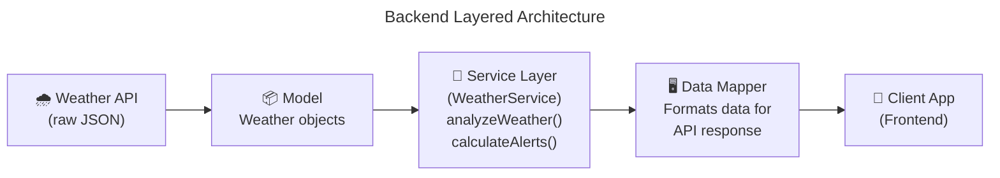

## 🧩 2. Backend Stack & Integrations
* [PostgreSQL](https://www.postgresql.org/) serves as the primary database, utilizing the [**PostGIS**](https://postgis.net/) extension to handle complex geographic queries and spatial data efficiently.
* [Supabase](https://supabase.com/) acts as our core hosting provider and development platform, managing the backend infrastructure and database hosting.
* [Supabase Auth](https://supabase.com/auth) manages user sessions via JWTs, supporting both traditional Email/Password and Social Login methods.
* [OpenWeatherMap API](https://openweathermap.org/api/one-call-3) provides real-time weather data via an Adapter Pattern (`IWeatherProvider`), allowing for easy swaps to other providers like Met.no.
* [Twilio API](https://www.twilio.com/en-us) handles emergency SMS triggers from the backend, ensuring critical alerts are delivered even if the client-side app crashes.
* [Mapbox Directions API](https://docs.mapbox.com/api/navigation/directions/) generates route coordinates for analysis and pathfinding.

## 🔌 3. API Specification
The backend communicates with the frontend via a structured API. For a full list of endpoints and request/responses schemas, please refer to the [**api.md**](./api.md) document.

* **Protocol:** RESTful API.
* **Format:** JSON.
* **Versioning:** `/api/v1/...`

## 🔐 4. Security
* **Row Level Security (RLS):** Enforced at the database level to ensure strict data isolation; users can only access their own records.
* **Authentication:** JSON Web Tokens (JWT) are used for secure session management and request authorization.

## 🧠 5. Main Business Logic
**Route Analysis Workflow:**

1. **Input:** Receive Start/End coordinates from the client.
2. **Fetch:** Retrieve Route Geometry from Mapbox.
3. **Segment:** Divide the route into segments (e.g., every 15 mins or 10km).
4. **Enrich:** Fetch weather data for each segment's specific timestamp and location.
5. **Analyze:** Return an enriched route object containing "Hazard Flags" (e.g., *"Segment 3: Heavy Rain"*).
# State Management Strategy 

## Overview 
this document outlines the statemanagement architecure for obsidian routes it will explain what data lives where , why and how different partts of the application share information.
state management is critical for a GPS tracking app where location data, ride status and iser preference must be accessible across multiple screen.

## 1. Global State(Zustand)
I will be using a tool called Zustand to keep track of the really importand stuff across the app. it is extremly quick and works great with React Native 

### what zustand stores

### 🧠 State Management Strategy 

State management is critical for ObsidianRoutes, as location data, ride status, and user preferences must be accessible across multiple screens. This architecture defines what data lives where and how the application shares information.

## 📖 1. Global State

[Zustand](https://zustand.docs.pmnd.rs/) is used for client-side global state management. It is lightweight, fast and integrates seamlessly with *React Native*. To ensure the app is resilient, specifically for tracking rides, certain stores are synced to local storage using `persist` middleware to `AsyncStorage`

### 🗃️ Zustand Stores 

Refer to [**database-schema.md**](./database-schema.md) for the underlying data models.

|   Store  | Responsibility | Persistence |
|----------|:---------------|:-----------:|
| **Auth** | Tracks the `user` profile, Supabase login `session`, and `isAuthenticated` status. | **No** |
| **Ride** | Manages `isRiding` status, `currentRoute` (GeoJSON), and live stats like `distanceTraveled`. | **Yes** |
| **Settings** | Handles user preferences like `theme` (Light/Dark), `units`, and notification toggles. | **Yes** |

### 🔍 TanStack Query Server State
[TanStack Query](https://tanstack.com/query/v5) is used to fetch asynchronous data from the backend. Caching and background synchronization are handled automatically, ensuring the app remains functional even with intermittent connectivity during a journey.

| Hook | Type | Behavior         |
| :---:| :--- | :--------------- |
| `useWeather` | Query | Fetches real-time weather; results are cached for 15 minutes to minimize API calls. |
| `useBikes` | Query | Retrieves the list of bikes registered to the current user. |
| `useHistory` | Query | Fetches the user's past ride history. |
| `useSaveRoute` | Mutation | Implements **optimistic updates**, reflecting a "Saved" status immediately while background sync completes. |
| `useUpdateOdometer` | Mutation | Synchronizes physical bike stats with the backend. |

## 📍 2. Local components state

For small temporary state, like text being typed before hitting "Submit", react build-in functions like useState and useReducer are utlized.


* User login session
* if user have logged in or out 

2. **User Current Ride** 
* If user is riding right now 
* the route user is taking 
* when it started 
* how far user have gone
* this information will be there if the app crashes. when it is reopened it will pick up right where it was left off

3. **User Preferences:**
* Light or dark mode 
* Metric or imperial units 
* what kind of notification a user wants

## 2. TanStack Query/ React Query (Server State)
This is used to fetch data from thew web. It handles response storage effeciently so the user can still still the information when they are offline 

* Things to fetch: 
    - The weather for where users are 
    - The list of user bikes
    - Users past rides
* Things to send:
    - Saving finished route it will show "saved" right away even if the upload is still happening in the background 
    - Updating users bike mileage

## 3. Local components state

* For small temporary state like text being typed before hitting "Submit" we can rely on react build-in functions like useState and useReducer 


# 🔌 API Documentation

## 📖 Overview
The application utilises a hybrid approach, with two distinct ways to access the backend. Standard data operations leverage the auto-generated REST interface via the *Supabase Client SDK*, while complex business logic is isolated in *Serverless Edge Functions*.

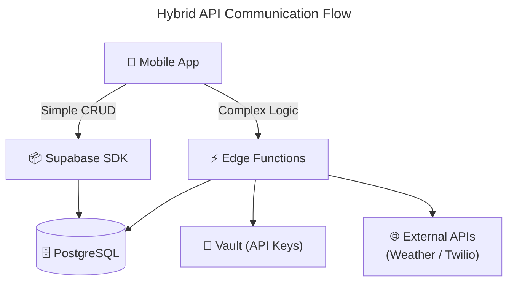

## ⚒️ 1. Supabase Client SDK 

This is used for simple things like reading/writing to the PostgreSQL tables using standard CRUD operations from the [Supabase JavaScript Client](https://supabase.com/docs/reference/javascript/introduction). Access is strictly governed by **Row Level Security (RLS)**, ensuring users can only interact with their own data.

E.g.

| Action | Resource | Example SDK Usage |
| :----- | :------- | :---------------- |
| **Read** | `bikes` | `supabase.from('bikes').select('*')` |
| **Create** | `routes` | `supabase.from('routes').insert({ name, path_geometry })` |
| **Update** | `user_profiles` | `supabase.from('user_profiles').update({ avatar_url }).eq('id', uid)` |
| **Sync** | `ride_history` | `supabase.from('ride_history').upsert(telemetry_data)` |

## ⚡ 2. Edge Funtions:

For the complex tasks that require API secret keys or more intensive processing the app sends requests to Supabase edge functions. These are written in *Typescript* and executed via the [Deno](https://deno.com/) runtime. 

> [!NOTE]
> Supabase uses the Deno runtime rather than Node.js; however, it natively supports npm modules and Node built-in APIs.

### 🛣️ Route Analysis
**Endpoint:** `(POST /functions/v1/analyze-route)`\
**RequestBody:** `{route_geometry, start_time}`\
**Output:** `{ hazards: [], safe: boolean }`
  
This function processes a planned route based on the journey start time. It performs the following steps:

1. Samples the route geometry approximately every 10 km.
2. Fetches weather data from the OpenWeatherMap API for each segment.
3. Flags dangerous conditions exceeding defined thresholds (e.g., heavy rain or wind speeds > 40 km/h).
4. Returns a list of hazards corresponding to each specific segment.

### 📞🆘 Emergency SOS
**Endpoint:** `(POST /functions/v1/send-sos)`\
**RequestBody:** `{ location, battery_level }`\
**Output:** `{ success: boolean, sent_attempt: n }`
   
This is triggered by the in-app Emergency button, this function:
1. Verifies the active user session and help request.
2. Retrieves the user's prioritized emergency contacts from the database.
3. Sends an SMS via the **Twilio API** containing the user's GPS location, a Google Maps link, and their current battery level.
# 🗄️ Database Schema  

## 📖 Overview
[PostgreSQL](https://www.postgresql.org/) serves as the application's primary database, hosted on [Supabase](https://supabase.com/) to leverage integrated authentication and real-time capabilities. This schema utilizes the [PostGIS](https://postgis.net/) extension for advanced spatial queries and high-performance geographic data handling. Additionally, `citext` and `uuid-ossp` are used for case-insensitive string comparisons and Universally Unique Identifiers (UUIDs), respectively.

## 📋┬─┬ Tables Overview

| Table | Description | Constraints | Key Relationships |
| :---: | :---------- | :-----------| :---------------- |
| **`users`** | Profiles extending Supabase Auth. | `email` (Unique, CITEXT) | **1:1** with `auth.users` |
| **`bikes`** | Motorcycle inventory and maintenance data. | `registration` (Unique) | **Many:1** with `users` |
| **`emergency_contacts`** | User-defined SOS recipients. | `priority_order` (Not Null) | **Many:1** with `users` |
| **`routes`** | Saved and planned paths with geometry. | `path_geometry` (Geography) | **Many:1** with `users` |
| **`ride_history`** | Logs of completed trips and telemetry. | `start_time` (Not Null) | **Many:1** with `users`/`bikes` |
| **`hazards`** | Community-reported road conditions. | `type` (Enum) | **Many:1** with `users` |
| **`points_of_interest`** | User-marked locations (Fuel, etc.). | `category` (Enum) | **Many:1** with `users` |
| **`emergency_alerts`** | Audit log of SOS activations and SMS status. | `twilio_sms_sid` (Unique) | **Many:1** with `ride_history` |


> [!NOTE]
> * All geographic columns use the `GEOGRAPHY` type for accurate real-world distance calculations, with **GIST indexes** used for efficient proximity searching.
> * `ride_history` stores `route_data` as a `JSONB` snapshot to preserve historical trip telemetry even if source routes are modified.
> * `emergency_alerts` logs every individual notification attempt; one SOS event can generate multiple alert rows - one for each contact notified.
> * Row Level Security (RLS) is enforced on all user-specific tables, ensuring users only access rows where `user_id` matches their `auth.uid()`.

## 🤝 Entity Relationship Diagram
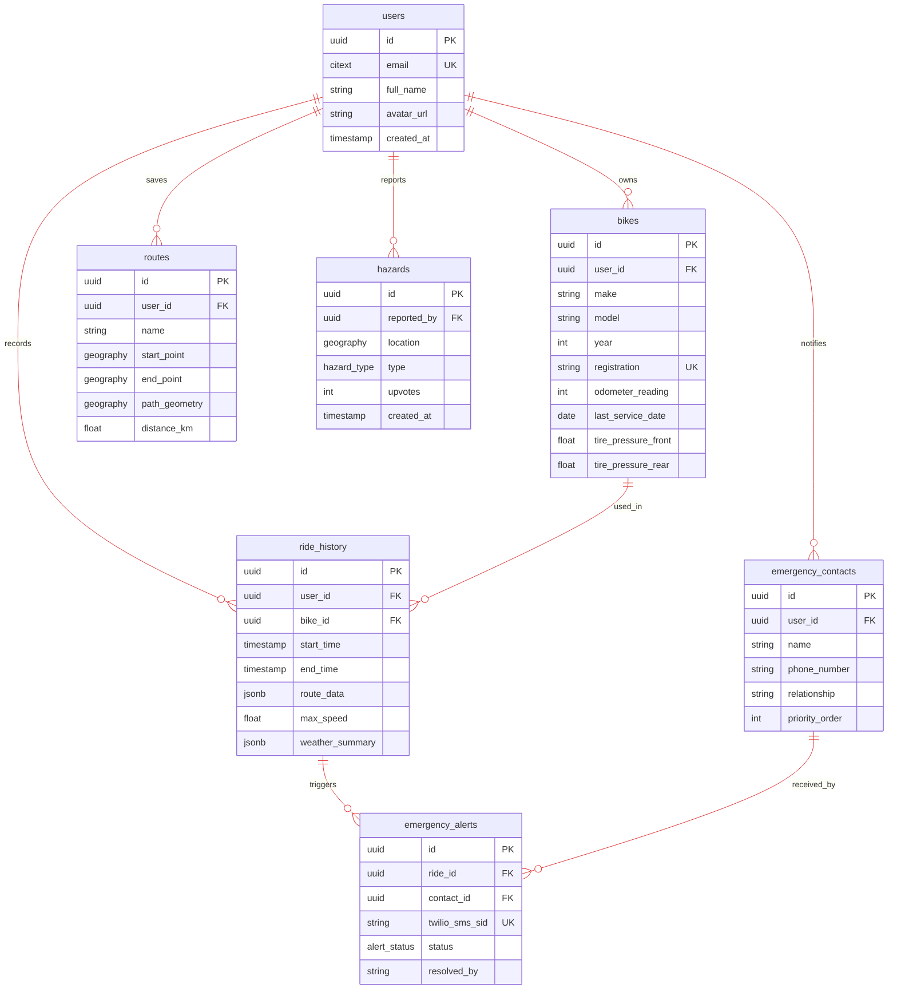
# 🛤️ User Flow Documentation

## 📖 Overview
The following diagrams describe how riders move through the ObsidianRoutes app to complete key workflows, such as planning routes, recording rides, managing bikes, handling emergencies, and reviewing ride history.

### Diagram Legend
| Role | Colour |
| :--- | :--- |
| *Entry points / Neutral states* | <svg width="4.5em" height="1.5em" style="vertical-align:middle"><rect width="100%" height="100%" rx="6" fill="#3d96d8" stroke="#000"/></svg> |
| *Success / Completion* | <svg width="4.5em" height="1.5em" style="vertical-align:middle"><rect width="100%" height="100%" rx="6" fill="#53ad2c" stroke="#000"/></svg> |
| *Warnings / Non-critical issues* | <svg width="4.5em" height="1.5em" style="vertical-align:middle"><rect width="100%" height="100%" rx="6" fill="#a27a037b" stroke="#000"/></svg> |
| *Errors / Critical failures* | <svg width="4.5em" height="1.5em" style="vertical-align:middle"><rect width="100%" height="100%" rx="6" fill="#f44336" stroke="#000"/></svg> |
---

## 1. First Time User  

### Happy Path

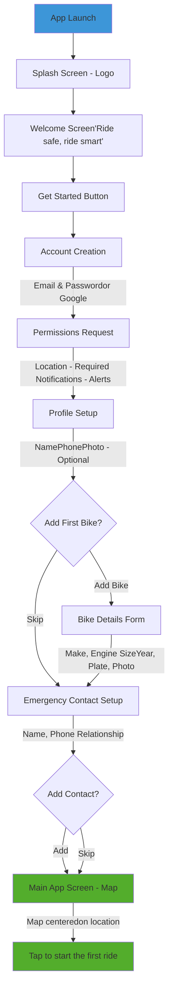

### Unhappy Path
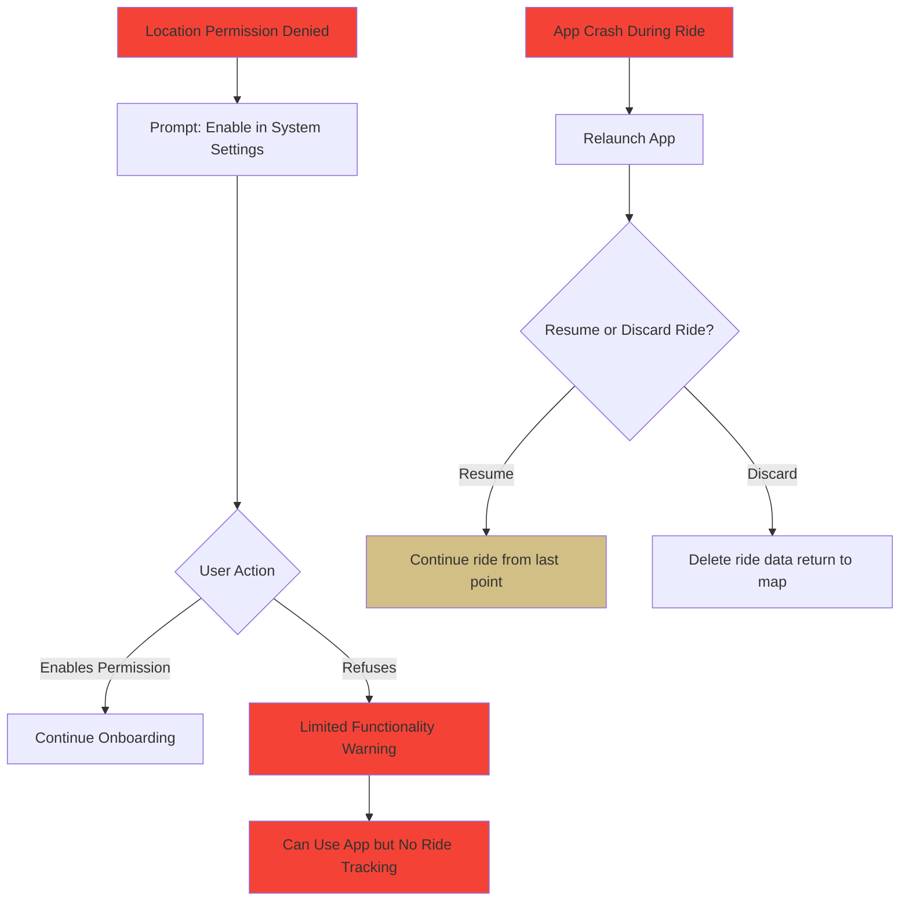

## Route Planning Flow

### Happy Path Flow 
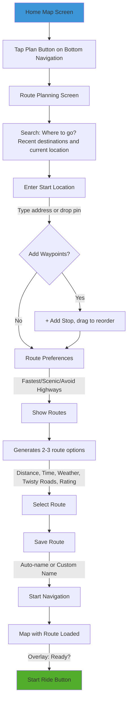

### Unhappy Path Flow

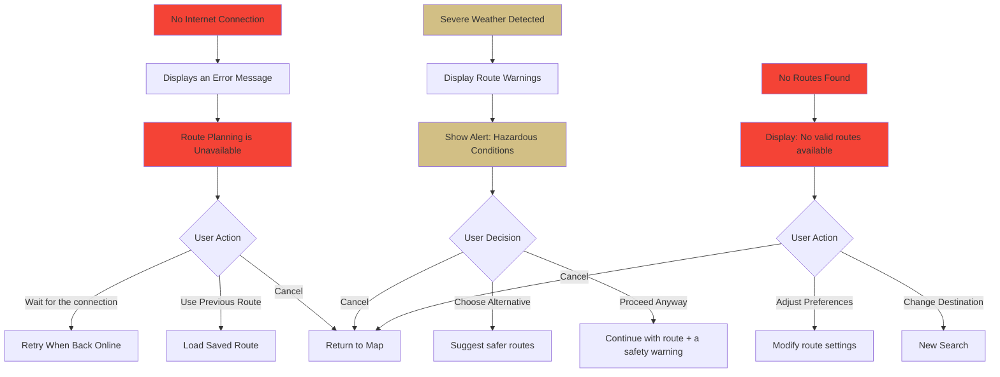

## 3. Starting and Recording a Ride

### Happy Path Flow 
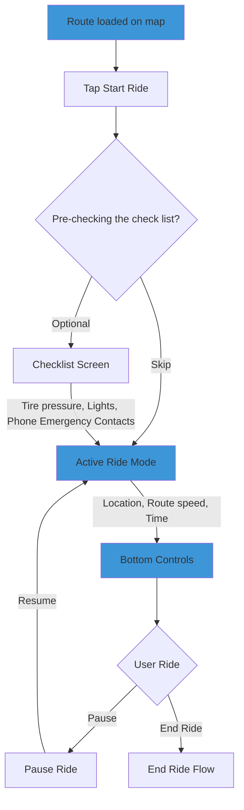
### A. Log Hazard Subflow 

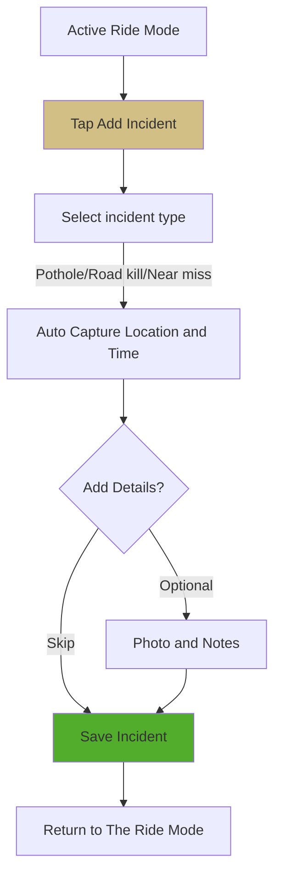
### B. Pause ride sub-flow
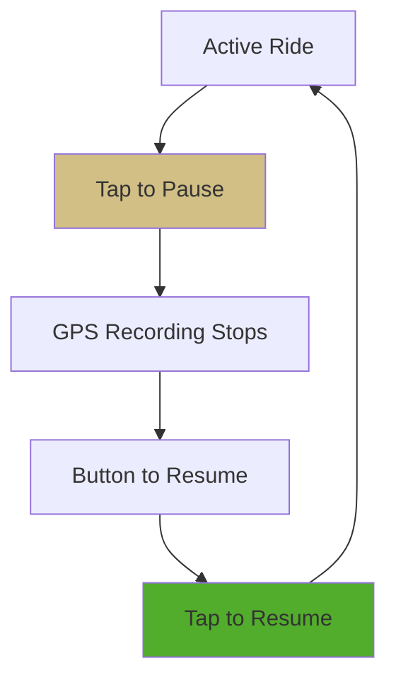

### C. End Ride Sub-flow
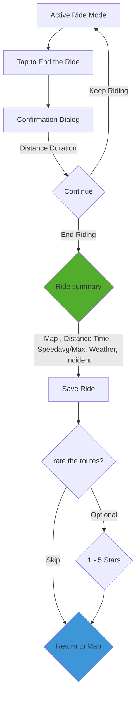

### Unhappy path flows 

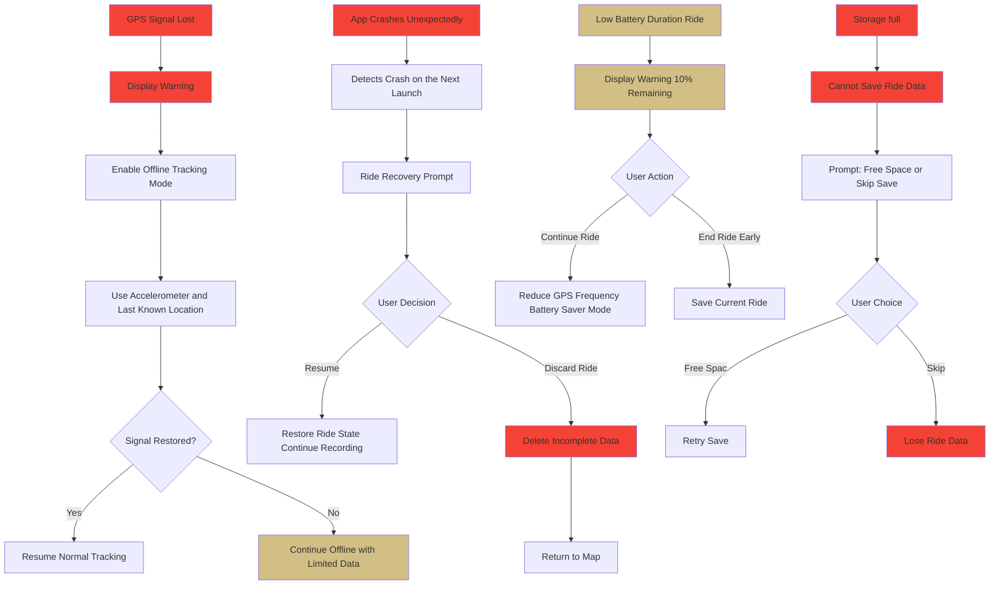

## 4. Emergency SOS 

### Happy path
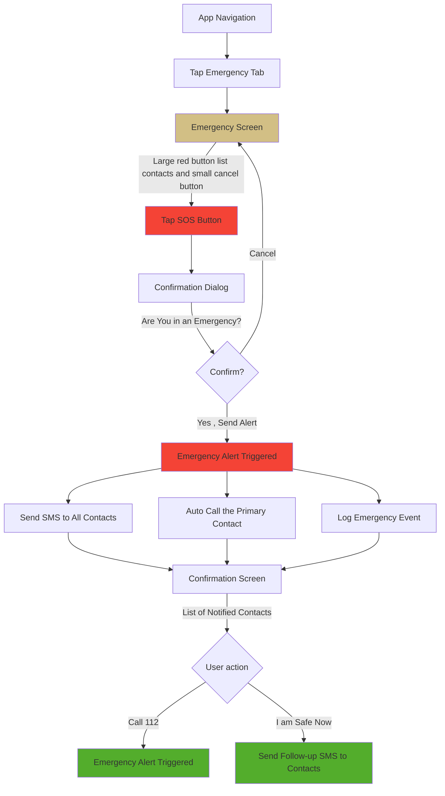

### Unhappy Path Flows

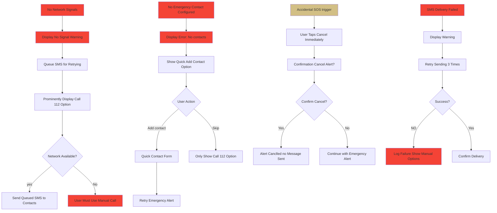


## 5. Manageing bikes (Garage)

### Happy Path Flow
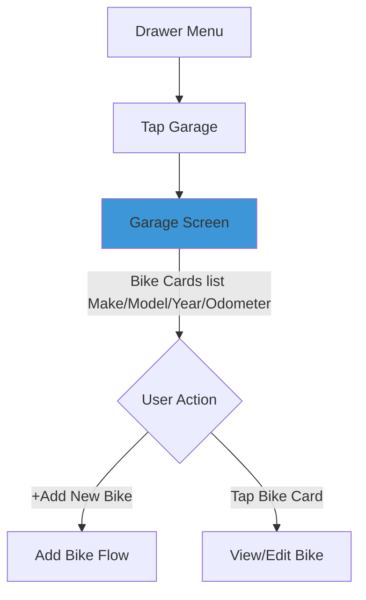
### A. Add bike subflow

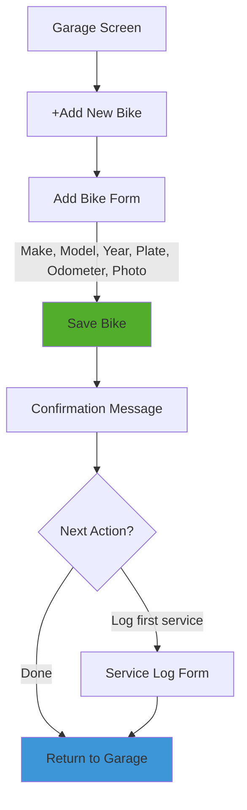

### B. View/Edit bike sub-flow

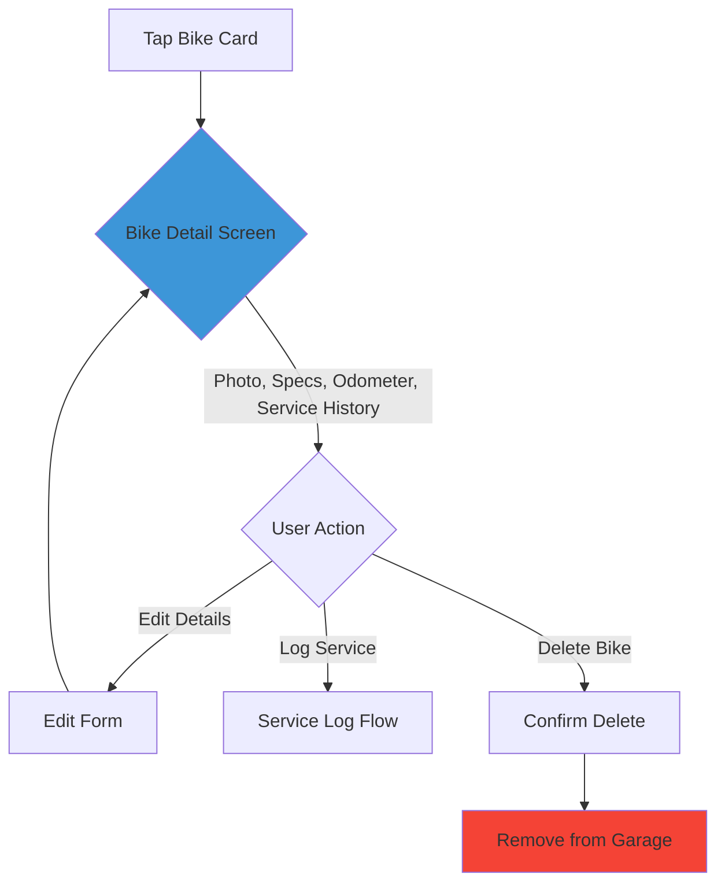

### C. Log service sub-flow
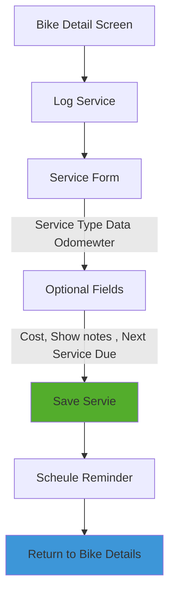
### Unhappy Path Flow 

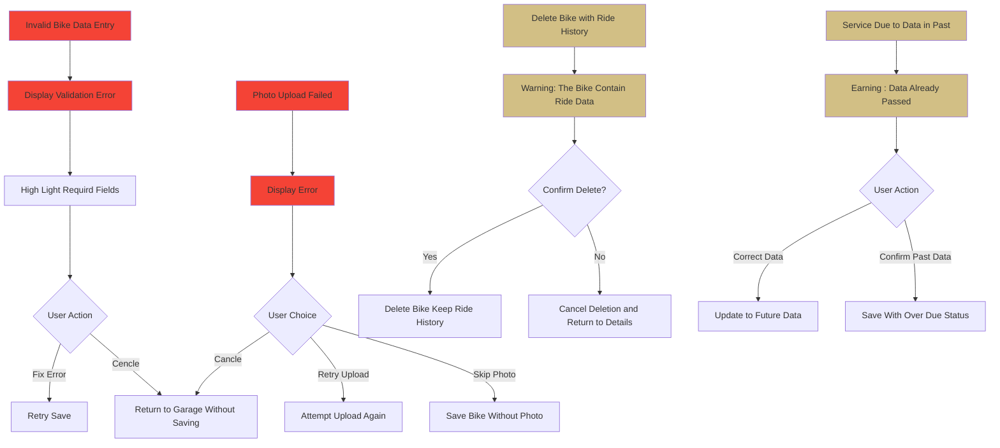

## 6. Ride history

### Happy path flow
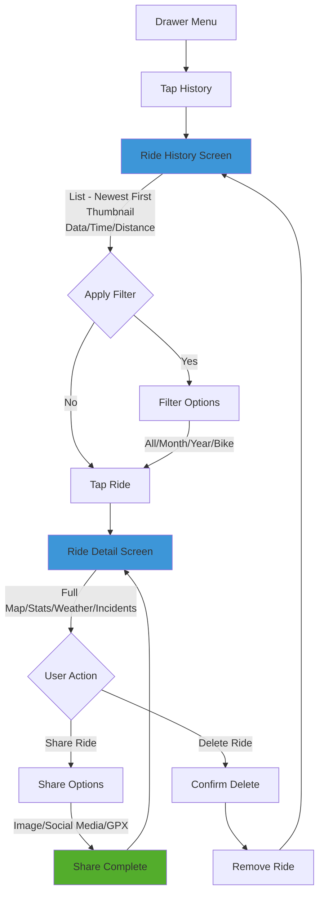
### Unhappy path floe

```mermaid 
flowchart
A[No Ride Found] --> B[Display Empty State]
B --> C[Show Prompt 'Start your First Ride']
C --> D{User Action}
D --> |Tap CTA| E[Navigate to Map]
D --> |Close| F[Return to Menu]

G[Share Failed] --> H[Display Error Message]
H --> I[Error Type]
I --> |No Internet| J[Retry When Online]
I --> |File Too Large| L[Compress File and Retry]

M[Delete Ride Confirmation] --> N[Warning: Cannot be Undone]
N --> O{Confirmation?}
O --> |Yes| P[Permenently Delete Ride]
O --> |No| Q[Cancel Deletion Keep Ride]

R[Corrupt Ride Data] --> S[Display Error: Ride Unreadable]
S --> T{User Action}
T --> |Delete Corruptdata| U[Remove Corrupt Ride]
T --> |Repost Issue| V[Send Error Log to Support]
T --> |Cancle| F

style A fill:#a27a037b
style B fill:#a27a037b
style G fill:#f44336
style H fill:#f44336
style M fill:#a27a037b
style R fill:#f44336
style S fill:#f44336

```


## 7. Setting Flow

### Happy path Flow

```mermaid
flowchart
A[Drawer Menu] --> B[Tap Settings]
B --> C[Setting Screen]
C --> D{Select Catagory}

D --> E1[Unit and Display]
E1 --> E2[Distance KM/Miles, Temp: C/F Speed: kmh/mph, Map Style: Dark mode/Light Mode]

D --> F1[Ride Setting]
F1 --> F2[Auto Pause / Pause / Checklist / Voice Guidance / Auto Record Ride]

D --> G1[Privacy]
G1 --> G2[Share Location/ Public Ride/ Emergency Permissions]

D --> H1[Account]
H1 --> H2[Edit Profile/ Change Password/Manage Contacts/ Delete Account]

D --> I1[About]
I1 --> I2[App Version/Privacy Policy and Service/Feedback/Rate App]

E2 --> J[Save Changes]
F2 --> J
G2 --> J
I2 --> K[External Link]


style C fill:#3d96d8
style J fill:#53ad2c
```

### Unhappy Path Flow

```mermaid
flowchart
A[Delete Account/ Request] --> B[Warning: All Data will be Lost]
B --> C[Require Password Confirmation]
C --> D{Verification}
D --> |Wrong Password| E[Error: Invaid Passweord]
E --> F{Retry?}
F --> |Yes| C
F --> |No| G[Cancel Deletion]
D  --> |Correct| H[Final Confirmation]
H --> I{Proceed?}
I --> |Yes| J[Delete Account and All Data]
I --> |No| G
J --> K[Logout and Return to Welcome Screen]

L[Change Password] --> M[Enter Current Password]
M --> N{Current Password Correct?}
N --> |No| O[Error: Wrong Password]
O --> P[Retry or Cancle]
N --> |Yes| Q[Enter New Password]
Q --> R{Passowrd Matches?}
R --> |No| S[Error: Password Dont Match]
S --> Q
R --> |Yes| T[Password Updated]

U[Permission Revoked by User] --> V[Display Impact Warning]
V --> W[Feature Limited or Disabled]
W --> X{User Account}
X --> |Keep Disabled| Z[Continue with Limitation]

style A fill:#a27a037b
style B fill:#a27a037b
style E fill:#f44336
style J fill:#f44336
style O fill:#f44336
style S fill:#f44336
style U fill:#a27a037b
style V fill:#a27a037b
style W fill:#a27a037b
```


### Color 


- #3d96d8**Light Blue** - Entry points and neutral states
- #53ad2c**Green** - Success states and completions
- #a27a037b **Brown** - Warnings and non-critical issues
- #f44336**Red** - Errors, failures, and critical issues

# ♾️ DevOps & CI/CD 

## 📖 Overview

The ObsidianRoutes infrastructure utilizes a lightweight DevOps setup. GitHub and Git are used for version control, GitHub Actions for automated quality gates, and [EAS (Expo Application Services)](https://expo.dev/eas) to handle the heavy lifting of Android builds. EAS is a deeply integrated cloud service for Expo and React Native apps that handles the complex build process in the cloud. By automating quality checks and offloading builds to the cloud, the project enables deployment with minimal manual intervention.

## 🪾 1. Source Control & Branching

The project utilizes [GitHub](https://github.com/) for version control, following a structured branching strategy to ensure stability:

* **`master`**: Contains production-ready code. Direct pushes are restricted.
* **`feature/*`**: Dedicated branches for new development (e.g., `feature/weather-overlay`).

## ֎ 2. GitHub Actions

CI/CD pipelines are orchestrated with `github actions` enforcing quality standards and handling deployments.

| Pipeline | Trigger | Tasks | Result  |
| :--------| :------ | :---- | :------ |
| **PR Quality Check** | Pull Request to `master` | Runs `ESLint`, `Prettier`, `Jest unit tests` and typescript `type-check`. | Validates code quality before merging. |
| **Android Deployment** | Push to `master` | Triggers a production build via [Expo Application Services (EAS)](https://expo.dev/eas). | Generates an `.apk` available in the Expo Dashboard. |


## 📈 3. Monitoring & Error Tracking
[Sentry](https://sentry.io/) is integrated into the React Native application to provide performance and error metrics. Examples include:
* Capturing and reporting unhandled JavaScript errors and native-level crashes (e.g., Mapbox failures).
* Tracking screen load times and network latency to identify UI bottlenecks.
# 🧪 Testing Plan

## 📖 Overview of testing 
ObsidianRoutes testing combines automated and manual testing to ensure correctness, reliability, and real-world usability. Testing covers main logic and isolated components to catch issues early and keep behavior predictable. End-to-end (E2E) tests validate user flows from login to starting a ride, ensuring the app works as expected from a rider's point of view. Manual testing complements automation by validating GPS behaviour, offline resilience, and on-bike usability. 

## ✅ 1. Unit testing 
Automated unit tests focus on isolating business logic and utility functions to ensure mathematical and logical accuracy. These tests are triggered automatically via GitHub Actions (see [**devops.md**](./devops.md)).

* Tools: [Jest](https://jestjs.io/) and [React native testing library](https://callstack.github.io/react-native-testing-library/)
* Coverage Targets: 
    * Weather analysis logic.
    * Distance calculations.
    * Form Validations.

## 📝 2. End to End Testing
E2E tests simulate real-world user interactions to ensure the integrated system, from the UI to the Supabase backend, work as intended.
* Tools: [Maestro](https://maestro.mobile.dev/)
* Primary Test suites:
    * **Login/Authentication Flow**: Validates that a user can log in, handle session persistence and lands on the app home screen.
    * **Garage Management Flows**: Validates navigation to the garage, adding/deleting motorcyles and verifying the record is correctly persisted.  
    * **Route Planning Flows:** Tests Mapbox geometry rendering given an origin and destination, and verifies if *Start Ride* can be triggered.

## 🕵️‍♂️ 3. Manual Testing
Beyond automation, as the app interacts with the users phone hardware, some scenarios require real-world hands-on verification such as:
 * *GPS behavior* and signal recovery in tunnels. 
 * *Offline resilience*, ensuring that data remains cached via TanStack Query and Zustand when a signal is lost mid-ride. 
 * *Usability* and *Accesibility* checks to verify UI legibility and button target sizes are appropriate for a mounted motorcycle environment and accessible for users with disabilities.

# 📚 Third-Party Libraries 
These are dependencies that provide pre-build functionality to accelerate the development instead of implementing everything from scratch

## 🔹 1. Core Framework 
 * ⚛️ **react-native**: Cross-platform mobile application framework that enable a single codebase to complile and run natively on both Andriod and IOS platform  
 * 🚀 **Expo**: Developmet tool chain that abstracts complex native configuration and provides management workflows for steamlined build processes
 * 🔤 **Typescript**: TypeScript is a statically typed version of JavaScript that checks errors at compile time

## 🔹 2. Navigation and UI 
 * 🚦 **@react-navigation**:Handles screen navigation and transitions between screen 
 * 📄 **react-native-paper**: Provides ready made Material design UI components
 * 🎯 **react-native-vector-icons**: Offers customizable icons from multiple icon set
 * 📐 **react-native-svg**: Enable Enable rendering of graphics and vector-based UI element 

## 🔹 3. Map and Location
 * 🗺️ **@rnmapbox/maps**: Mapbox SDK for interactive maps with custom titles and overlay
 * 📍 **expo-location**: Access device GPS and location services
 * 📐 **turf**: Analysis and geometric calculations on coordinates

## 🔹 4. State Management and data
 * 🧠 **zustand**: Lightweight state management for global app state with minimal boilerplate
 * 🔄 **@tanstack/react-query**: Server state caching background refetching and request deduplication.
 * 🗄️ **@supabase/supabase-js**: Client SDK for database, authentication and real-time subscriptions
 * **async-storage**: Persistent local key-value storage

## 🔹 5. Form and utilities 
 * 📝 **react-hook-form**: Form validation library using React hook
 * ✅ **zod**: Runtime type checking and data validation with schemas
 * 📅 **date-fns**: Data parsing, formatting and manipulation utilities
 * 📲 **expo-sms**: Access the devices SMS functionality programmatically

## 🔹 6. Backend 
 * 📡 **twilio**: Cloud communication API sending SMS notification and alerts
 * 🌐 **axios**: Promise-based HTTP client for RESTful API request with interceptor support

## 🔹 7. Testing
 * 🧪 **jest**: JavaScript testing framework for unit and snapshot testing
 * 🤖 **maestro**: End-to-end testing for mobile apps simulation user interactions
 
