# 🛤️ User Flow Documentation

## 📖 Overview
The following diagrams describe how riders move through the ObsidianRoutes app to complete key workflows, such as planning routes, recording rides, managing bikes, handling emergencies, and reviewing ride history.

### Diagram Legend
| Role | Colour |
| :--- | :--- |
| *Entry points / Neutral states* | <svg width="4.5em" height="1.5em" style="vertical-align:middle"><rect width="100%" height="100%" rx="6" fill="#3d96d8" stroke="#000"/></svg> |
| *Success / Completion* | <svg width="4.5em" height="1.5em" style="vertical-align:middle"><rect width="100%" height="100%" rx="6" fill="#53ad2c" stroke="#000"/></svg> |
| *Warnings / Non-critical issues* | <svg width="4.5em" height="1.5em" style="vertical-align:middle"><rect width="100%" height="100%" rx="6" fill="#a27a037b" stroke="#000"/></svg> |
| *Errors / Critical failures* | <svg width="4.5em" height="1.5em" style="vertical-align:middle"><rect width="100%" height="100%" rx="6" fill="#f44336" stroke="#000"/></svg> |
---
## 1. First Time User  

### Happy Path

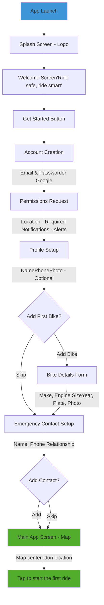

### Unhappy Path
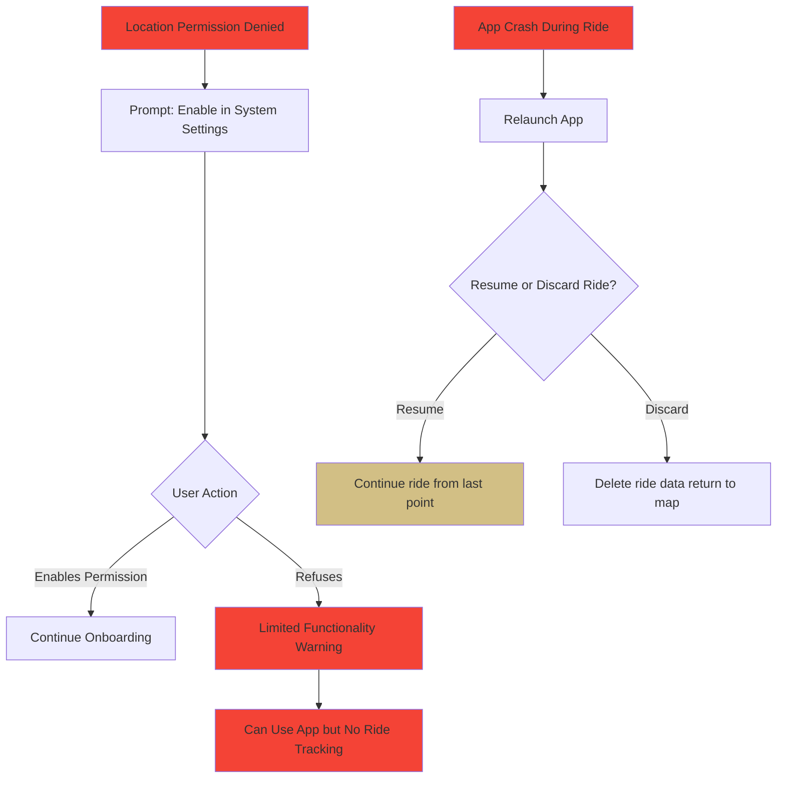

## Route Planning Flow

### Happy Path Flow 
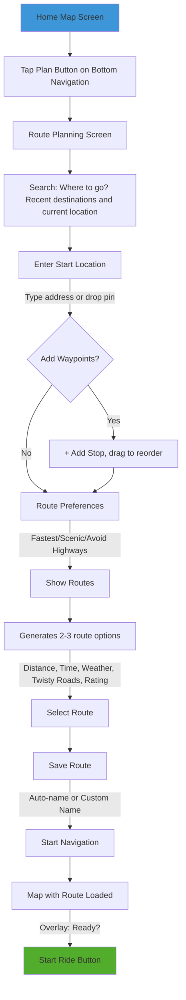

### Unhappy Path Flow

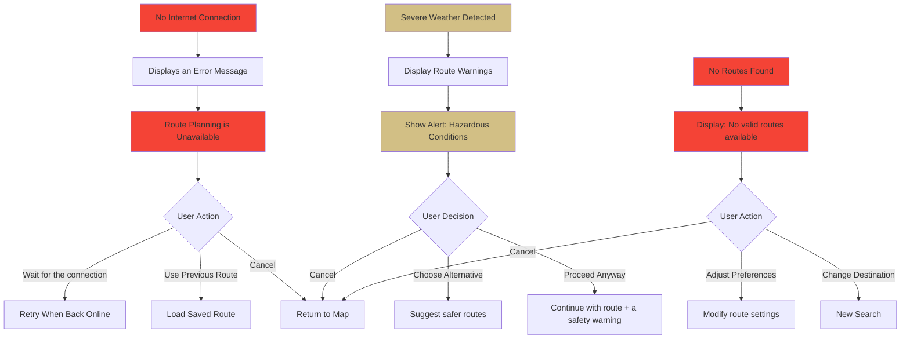

## 3. Starting and Recording a Ride

### Happy Path Flow 
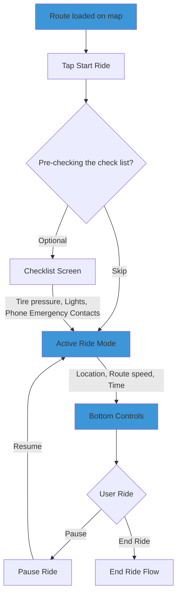
### A. Log Hazard Subflow 

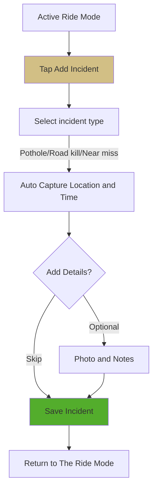
### B. Pause ride sub-flow
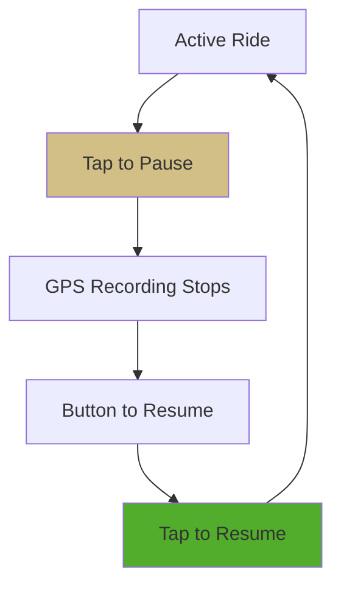

### C. End Ride Sub-flow
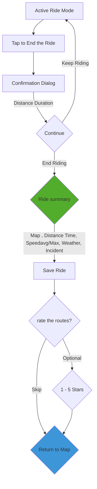

### Unhappy path flows 

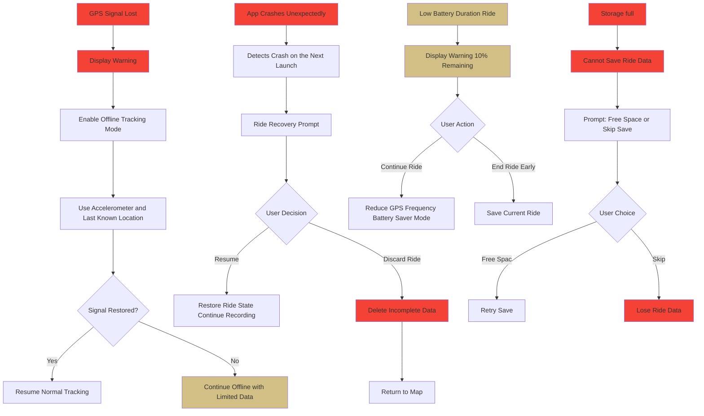

## 4. Emergency SOS 

### Happy path
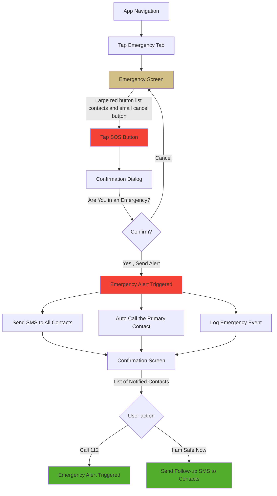

### Unhappy Path Flows

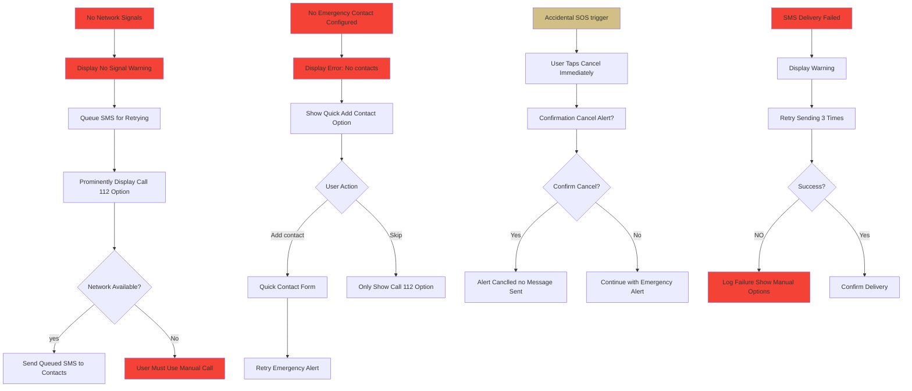

## 5. Manageing bikes (Garage)

### Happy Path Flow
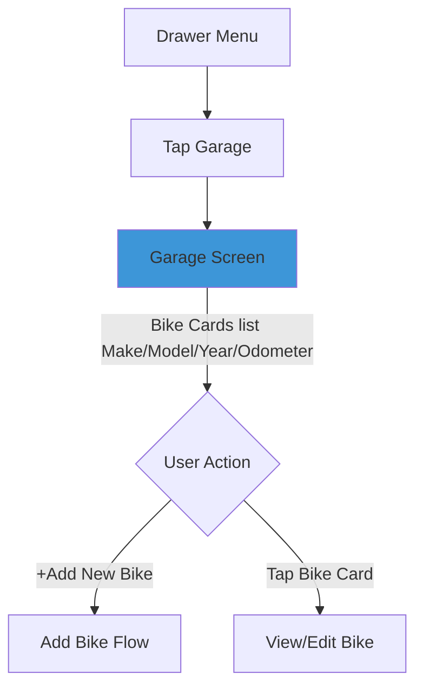
### A. Add bike subflow

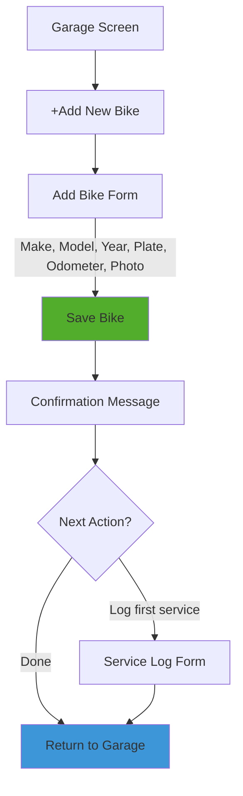

### B. View/Edit bike sub-flow

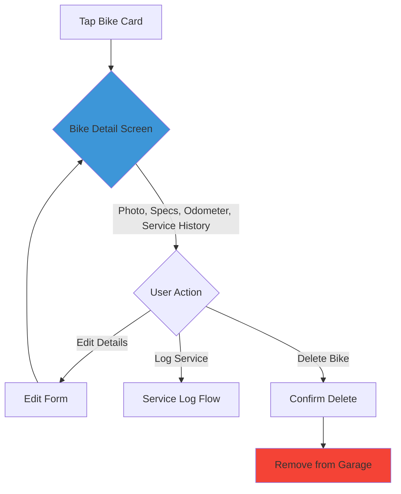

### C. Log service sub-flow
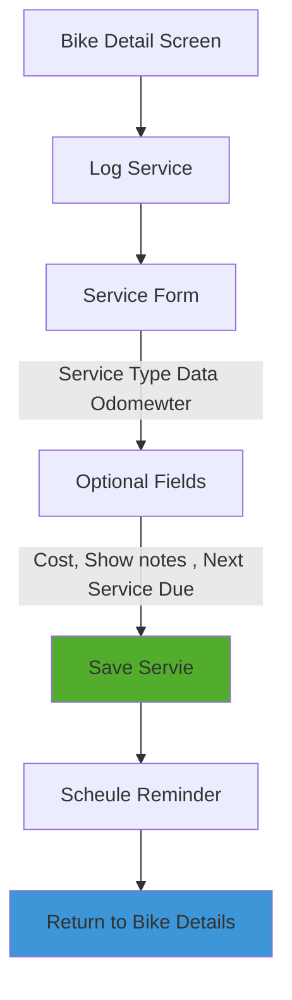
### Unhappy Path Flow 

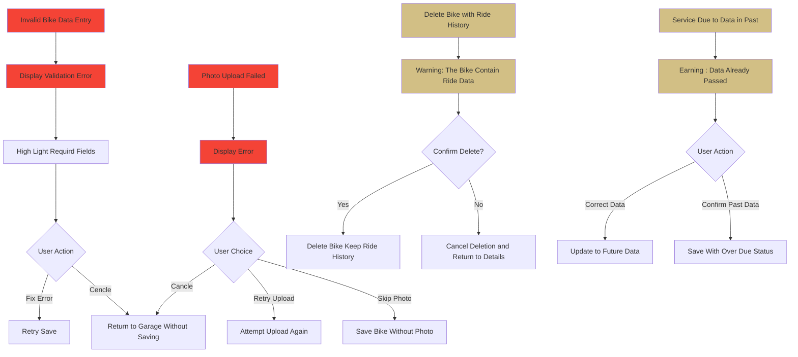

## 6. Ride history

### Happy path flow
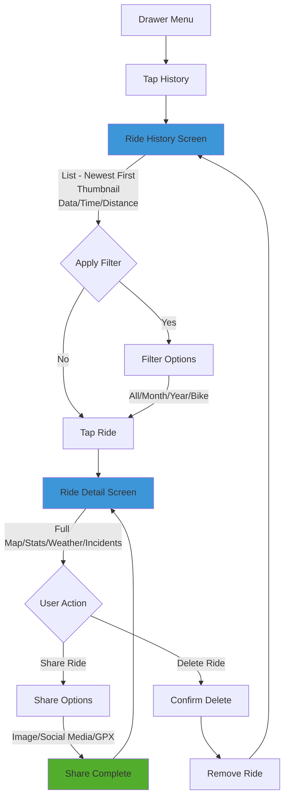
### Unhappy path floe

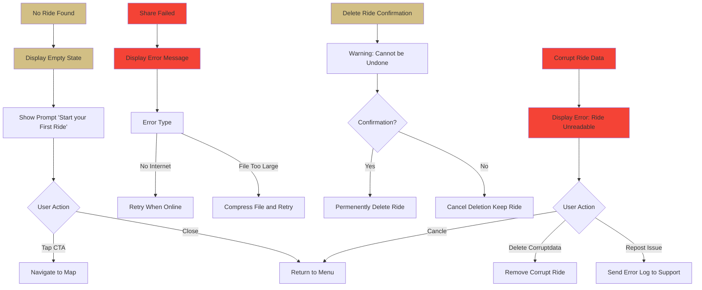

## 7. Setting Flow

### Happy path Flow

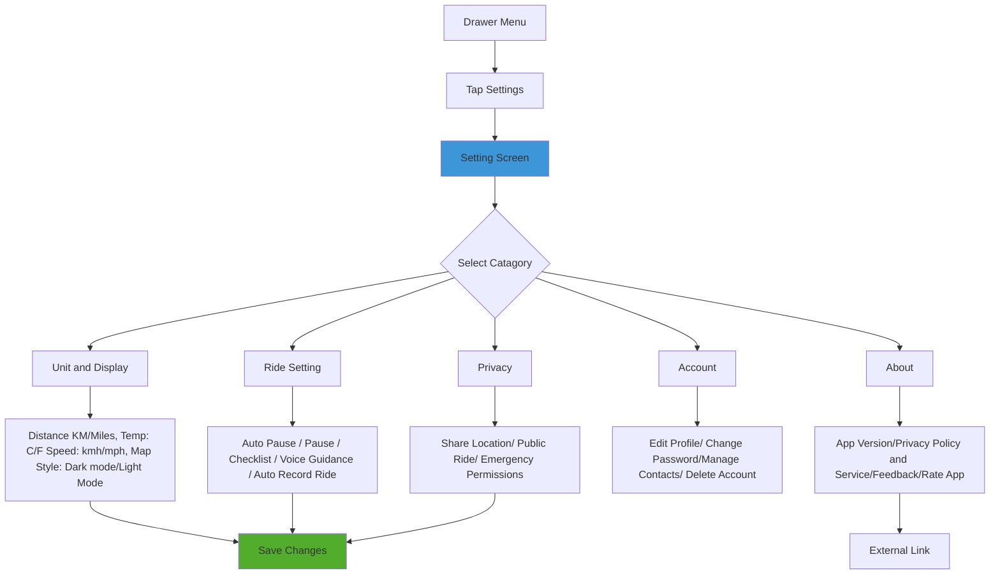

### Unhappy Path Flow

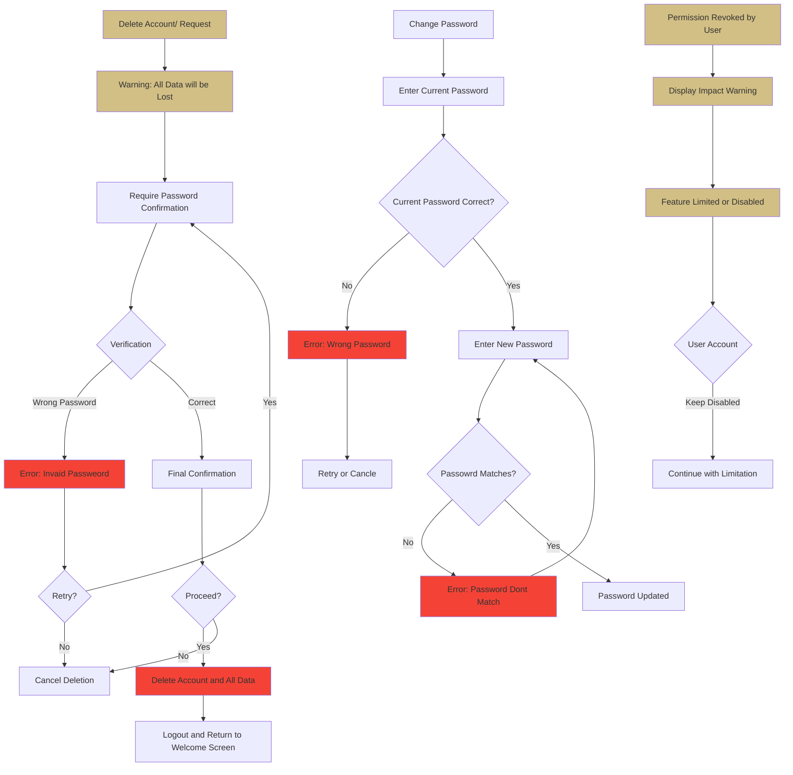
